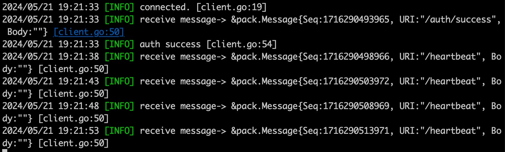

## Plex
- 轻量级`Golang TCP`框架，纯原生实现
- `Plex` 主要涉及为发送简单指令给客户端的框架，所以暂时不设计 `IM` 功能，消息体也就不复杂
- 包含鉴权、连接管理、心跳、服务端推送等功能
- 包含`TCP`服务端、业务推送端
- 使用`json`通信协议，后续将会支持`protobuf`等其他更多协议

## 功能规划
- 连接实现
- 连接管理
- 连接鉴权
- 消息协议
- 心跳
- 消息推送
- 用户连接状态查询

## 架构简述
- `PlexServer` 作为主要服务，实现 `TCP` 连接、连接管理、鉴权、推送功能

- `PlexServer` 实现了 `HTTP` 接口，接口路径为： `/plex/v1/host` ，客户端通过请求改接口获取到连接的 `ip`、`port` 信息，目前主要负载均衡暂时使用的是随机算法

- `PlexClient`主要功能为启动了一个 `TCP` 客户端，连接上 `PlexServer` ，之后可以调用 `PlexClient` 的 `Send` 方法进行消息推送

- 业务服务可自定义，根据自己的服务器架构定义当前的鉴权、发送流程

- 简要架构图可参照下方图片，具体代码可以通过详细代码查看


## 消息协议

### 消息头
- headSize: 消息头为 4 字节的长度字段，使用大端序（Big Endian）编码，表示消息体的长度。使用大端序还是小端序可以通过配置设置，默认大端序

### 消息体
消息体是一个 JSON 格式的对象，包含以下字段：

- `Seq`: 消息序号，`int64` 类型，用于标识消息的顺序
- `URI`: 标识符，`string` 类型，用于描述消息的类型或用途
- `Body`: 数据体，`string` 类型，包含具体的消息内容

具体结构如下：

```json
{
  "seq": 12345,
  "uri": "/example/uri",
  "body": "example body content"
}
```

## 配置说明

默认都有默认配置，也可以在启动时重新配置

```
// Config
type Config struct {
	// TCP监听端口，默认 9578
	Port string
	// Http api 监听端口号，默认 9579
	HttpPort string
	// 多机部署，服务器地址["123.123.45.67:9587", "123.123.45.68:9587"]，部署多台机器时，需要将外网IP都配置在这里
	OuterServers []string
	// 内部通信密码，主要用于 PlexClient 请求时，校验的密码，需要与 PlexClient 保持一致，默认 plex-inner
	InnerPassword string
	// 显示详细运行日志，默认 false
	ShowTrace bool
	// 最大连接数，可以不设置
	MaxConnection int
	// 等待鉴权超时时间，超时未鉴权即会断开连接(默认30秒)
	AuthTimeout int64
	// 心跳时间间隔(默认60秒)
	Heartbeat int64
	// 心跳超时时间，超时即会断开连接(默认120秒)
	HeartbeatTimeout int64
	// 是否是小端字节序(默认是大端字节序)
	LittleEndian bool
}
```

### 使用案例
- 目前开发了简单的使用案例，其中`plexApi`为业务服务，`plexServer`为 `TCP`服务 [点击查看](https://github.com/swxctx/plex/tree/main/example/demo)

- `PlexClient` 消息推送工具[点击查看](https://github.com/swxctx/plex/tree/main/client)

- 使用例子[点击查看](https://github.com/swxctx/plex/tree/main/example)

- [客户端-安卓对接SDK](https://github.com/swxctx/plexAndroid)，目前实现了安卓版本 `SDK`，可以快速集成到自己的应用中

## 安装

```
go get -u github.com/swxctx/plex
```

### 启动`PlexServer`

```
import (
	"fmt"
	"strconv"

	"github.com/swxctx/plex"
	"github.com/swxctx/plex/plog"
)

func main() {
	authFunc := func(body string) (bool, string) {
		plog.Infof("auth, body-> %s", body)
		uid, err := strconv.ParseInt(body, 10, 64)
		if err != nil {
			plog.Errorf("ParseInt: err-> %v, str-> %s", err, body)
			return false, ""
		}
		return true, fmt.Sprintf("%d", uid)
	}

	// new server
	plex.Start(&plex.Config{
		Port:         "9578",
		HttpPort:     "9500",
		OuterServers: []string{"117.50.198.225:9578"},
		ShowTrace:    true,
		AuthTimeout:  5,
	}, authFunc)
}
```

运行如图所示


### 连接测试

```
func main() {
	// connect plex server
	conn, err := net.Dial("tcp", "127.0.0.1:9578")
	if err != nil {
		plog.Errorf("err-> %v", err)
		return
	}
	plog.Infof("connected.")

	authSuccess := false
	// 循环接收消息
	for {
		if !authSuccess {
			// 发送消息
			writeData, err := pack.Pack(&pack.Message{
				URI:  "/auth/server",
				Body: "plex-example",
			})
			if err != nil {
				plog.Errorf("pack err-> %v", err)
				return
			}
			conn.Write(writeData)
		}

		message, err := pack.Unpack(conn)
		if err != nil {
			plog.Errorf("unpack err-> %v", err)
			if err == io.EOF || err == io.ErrUnexpectedEOF {
				conn.Close()
				break
			}
			continue
		}
		if message == nil {
			continue
		}

		plog.Infof("receive message-> %#v", message)
		if message.URI == "/auth/success" {
			authSuccess = true
			go startClientHeartbeat(conn)
			plog.Infof("auth success")
		}
	}
}

// startClientHeartbeat
func startClientHeartbeat(conn net.Conn) {
	msg, err := pack.Pack(&pack.Message{
		URI: "/heartbeat",
	})
	if err != nil {
		plog.Errorf("client heartbeat err-> %v", err)
		return
	}

	// time ticket
	ticker := time.NewTicker(5 * time.Second)
	defer ticker.Stop()

	for {
		select {
		case <-ticker.C:
			if _, err := conn.Write(msg); err != nil {
				plog.Errorf("client heartbeat send err-> %v", err)
				return
			}
		}
	}
}
```

运行如图所示

